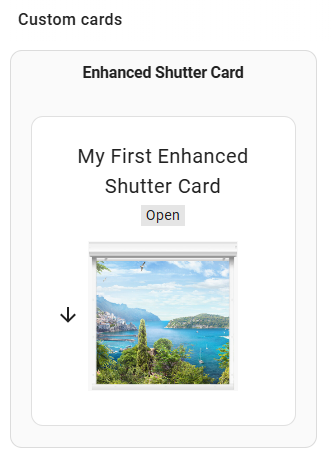
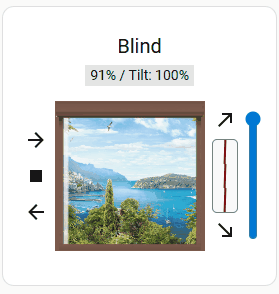
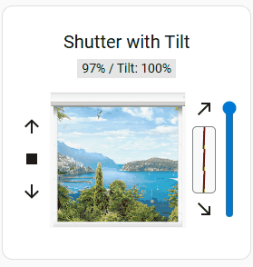

# Everyday Shutter Card

> Animated Lovelace shutter / cover card for Home Assistant. HA-theme-aware dark mode, full ARIA accessibility, DE / EN / FR / ES locale support, tilt + position grid + presets. Drop-in for `enhanced-shutter-card`.

[](https://github.com/f17mkx/everyday-shutter-card/releases)
[](LICENSE)
[](https://www.home-assistant.io/)
[](https://hacs.xyz/)
[](https://github.com/sponsors/f17mkx)
[](https://www.buymeacoffee.com/f17mkx)



## Why this exists

The stock cover entity card and Mushroom cover renderer give you a single slider plus three buttons. Works fine for one shutter. Falls apart when you have a window with both position AND tilt (Venetian blind, awning, day-night roller) and want the slat angle visualised, or you live on a dark HA theme and the legacy white-PNG slat assets glow like a lightbox. The upstream `enhanced-shutter-card` covers tilt + presets but ships hardcoded greys, no ARIA, and a noisy console on panel-view dashboards.

`everyday-shutter-card` fixes those four papercuts in one fork while staying drop-in compatible with the upstream YAML.

## What it does

- **HA-theme-aware dark mode**: detects `hass.themes.darkMode` AND `prefers-color-scheme: dark`, applies a per-asset filter (`brightness × contrast × saturate`) so the legacy PNG slats stop glowing on dark dashboards. Pre-baked dark frame asset for built-in window backgrounds; runtime filter for custom user images.
- **Tilt visualisation**: slat angle rendered in real time as a 2D widget, drag-to-set tilt position, separate from the position slider. Works with both `set_cover_tilt_position` and `open_cover_tilt` / `close_cover_tilt`.
- **Position grid**: six preset positions (0 / 20 / 40 / 60 / 80 / 100 %) as a tap-grid below the main slider for one-tap recall without dragging.
- **Partial-open button**: configurable "set to X %" shortcut (default 50 %).
- **Cover presets**: `roller-shutter`, `curtain`, `awning`, `blind`, `shade` — each ships its own slat / edge / window PNG so the card looks right out of the box for whatever the entity actually controls.
- **Full ARIA accessibility**: every up / stop / down / tilt / partial / position-grid button carries an `aria-label` mirroring the localised tooltip. Live region (`role="status" aria-live="polite"`) announces position changes politely to screen readers, debounced 500 ms so dragging doesn't spam. `:focus-visible` ring only (mouse clicks stay clean). Lock indicator `role="img" aria-label="locked"`. Tested with macOS VoiceOver.
- **Clean console**: the upstream warnings `Could not find div.card` and `Could not find grid container` are silently no-op'd in panel-view dashboards where they're expected. Real errors (service unavailable, image load failures) stay visible. Toggle via `SILENCE = false` at the top of `dist/everyday-shutter-card.js` for debugging.
- **Localised**: DE / EN / FR / ES out of the box via `hass.locale.language`. Reactive — switch HA → Profile → Language and every card re-renders without a reload. Locale-correct percent formatting (de/fr get `55 %` non-breaking space; en/es stay compact `55 %`).
- **Drop-in replacement**: same YAML config as `enhanced-shutter-card`; only the `type:` prefix changes.
- **Tested**: 59 Vitest unit tests on pure logic (position math, config merge, state-colour mapping) + 4 Playwright smoke tests against an HA-stub HTML page. CI green-bar on every PR + byte-compare drift guard against the committed `dist/`.

### Tilt + position controls



### Full-detail tilt widget



## Install (via HACS)

This card is **in the HACS default store**. Search and install:

1. Open HACS in Home Assistant
2. Search for "Everyday Shutter Card"
3. Download
4. Hard-refresh the dashboard (Cmd / Ctrl + Shift + R)
5. Add the card to a dashboard via the visual editor or YAML

If the card was previously installed as `superpro-shutter-card` (its name before 2026-05-13), uninstall the old one first — there is no automatic redirect.

## Install (manual)

1. Download `everyday-shutter-card.js` from the [latest release](https://github.com/f17mkx/everyday-shutter-card/releases/latest).
2. Copy into `<config>/www/community/everyday-shutter-card/` (create the folder if missing).
3. Also download `everyday-shutter-card.zip` from the release and extract `images/` into the same folder — HACS' plugin tree-walker only ships top-level files, so the slat / window / preset PNGs need manual extraction.
4. Add to your Lovelace resources:

```yaml
url: /hacsfiles/everyday-shutter-card/everyday-shutter-card.js
type: module
```

5. Hard-refresh and add the card in dashboard edit-mode.

## Quick start

A single shutter:

```yaml
type: custom:everyday-shutter-card
entities:
  - entity: cover.bedroom_shutter
```

With a friendly name override:

```yaml
type: custom:everyday-shutter-card
entities:
  - entity: cover.bedroom_shutter
    name: Bedroom
```

Multiple shutters side-by-side:

```yaml
type: custom:everyday-shutter-card
entities:
  - entity: cover.bedroom_shutter
  - entity: cover.living_room_shutter
  - entity: cover.kitchen_shutter
```

Awning preset (different PNG assets):

```yaml
type: custom:everyday-shutter-card
entities:
  - entity: cover.terrace_awning
    preset: awning
```

Force dark-mode filter regardless of HA theme:

```yaml
type: custom:everyday-shutter-card
entities:
  - entity: cover.bedroom_shutter
data_force_dark: "1"
```

## Configuration

The card carries over **every YAML key** from `enhanced-shutter-card` — only the `type:` prefix changes. For the full upstream schema (entities, tilt, partial-open, presets, button-hide states, image_map, position grid, passive mode) see [enhanced-shutter-card configuration](https://github.com/marcelhoogantink/enhanced-shutter-card#configuration).

### Theme override tokens

Drop these into your HA theme YAML to recolour without forking:

| Property | Default | Purpose |
|---|---|---|
| `--esc-tilt-container-bg` | `var(--secondary-background-color, #f9f9f9)` | Tilt widget background |
| `--esc-tilt-container-border` | `var(--divider-color, grey)` | Tilt widget border |
| `--esc-tilt-line-color` | `var(--error-color, red)` | Tilt-angle indicator line |
| `--esc-movement-overlay-bg` | `rgba(0,0,0,0.3)` | "Shutter moving" overlay tint |
| `--esc-dark-asset-filter` | `brightness(0.82) contrast(1.08) saturate(0.92)` | CSS filter on legacy PNG slats under dark mode |
| `--esc-dark-frame-overlay` | `rgb(115, 115, 115)` | Window-frame dark-mode multiply overlay |

Opt out of the dark filter for a single card: `data-force-light="1"` attribute. Force on regardless of OS / HA theme: `data-force-dark="1"`.

### Dark-mode behaviour

The card listens to two signals and applies the dark-mode filter when either is true:

1. `prefers-color-scheme: dark` — OS / browser-level dark mode
2. `hass.themes.darkMode === true` — Home Assistant theme is in its dark variant (set via HA → Profile → Theme, or via theme-switch automations)

A single per-card override always wins:

- `data-force-light="1"` — disables dark mode unconditionally
- `data-force-dark="1"` — enables dark mode unconditionally

The `--esc-dark-asset-filter` CSS variable controls the per-asset filter strength. Set it to `none` in your theme to opt-out globally.

### Accessibility behaviour

| Aspect | Behaviour |
|---|---|
| Keyboard focus | `outline: 2px solid var(--focus-ring-color, currentColor)` on `:focus-visible` only |
| ARIA labels | Up / Stop / Down / Tilt / Partial / position-grid buttons each carry localised `aria-label`; decorative icons are `aria-hidden="true"` |
| Live region | `role="status" aria-live="polite"` announces `"{Friendly name}: {position text}"` on settled-state changes, debounced 500 ms |
| Lock indicator | `passive_mode: true` renders the lock icon with `role="img" aria-label="locked"` |
| Group label | Each shutter is wrapped in `role="group" aria-label="{Friendly name}"` so screen readers can navigate by entity |

### Localisation (DE / EN / FR / ES)

The card follows `hass.locale.language` reactively — switch HA → Profile → Language and every label re-renders without a page reload. Other locales fall back to English.

| Source | Translated |
|---|---|
| `hass.localize()` (HA core) | Cover states (`open`, `closed`, `opening`, `closing`), button verbs, `unavailable` |
| Card-private `TRANSLATIONS` dict | "Battery" / "Signal" aria-prefixes, "locked", "Fully open / closed", "Partially open / closed", "Tilt" position-text prefix |
| `Intl.NumberFormat` | Position percentage display — `de`/`fr` get `55 %` non-breaking space, `en`/`es` get `55 %` compact |

Preset config tokens (`awning`, `curtain`, `roller-shutter`, `shade`, `blind`) are **not** translated — they are YAML config keys and translating them would break existing users' dashboards.

#### Contributing a new locale

1. Find the `TRANSLATIONS` const in `dist/everyday-shutter-card.js` (just below `LOCALIZE_TEXT`).
2. Add an entry keyed by ISO 639-1 code (`it`, `nl`, `pt`, …).
3. Translate every key present in the `en` block — missing keys silently fall back to English.
4. Test: change HA → Profile → Language, reload the dashboard, eyeball every shutter card.
5. PR with one screenshot per state (open / partial / closed / locked).

## Migration from enhanced-shutter-card

```yaml
# Before
type: custom:enhanced-shutter-card

# After
type: custom:everyday-shutter-card
```

Every other YAML key carries over unchanged. The card is a drop-in replacement.

## Support the work

This card is free, GPL-3.0, and built by one person on the side. If it spared you an evening of CSS-wrestling, the easiest way to say thanks:

[](https://www.buymeacoffee.com/f17mkx) &nbsp; [](https://github.com/sponsors/f17mkx)

Every tip funds the next card in the family: `everyday-light-card`, `everyday-climate-card`, `everyday-themes`.

## Roadmap

| Version | Status | What |
|---|---|---|
| v0.1 | ✅ Shipped | Rebranded fork of `enhanced-shutter-card` v1.5.2, no behaviour change |
| v0.2 | ✅ Shipped | Dark-mode theming (CSS theme tokens + PNG dark-filter) |
| v0.3 | ✅ Shipped | Full ARIA accessibility + clean console |
| v0.4 | ✅ Shipped | i18n (DE / EN / FR / ES) |
| v0.5 | ✅ Shipped | Test harness (Vitest + Playwright + Rollup build) |
| v1.0 | ✅ Shipped | HACS default store + public launch |
| v1.0.8 | ✅ Shipped | Pre-baked dark window frame, full `sp-*` asset rebrand |
| v1.0.9 | ✅ Shipped | Brand rename `superpro-shutter-card` → `everyday-shutter-card`, public-repo docs polish |
| v1.x | Planned | Performance budget (`<100 KB` gzipped), additional locales (it / nl / pt), translation file split, asset inlining (kill the zip-extract step) |

Follow [@f17mkx on GitHub](https://github.com/f17mkx) for releases.

## Credits

Upstream lineage:

- [`Deejayfool/hass-shutter-card`](https://github.com/Deejayfool/hass-shutter-card) — original card (2022, GPL-3.0)
- [`marcelhoogantink/enhanced-shutter-card`](https://github.com/marcelhoogantink/enhanced-shutter-card) — active fork with Tilt + presets (2024, GPL-3.0)
- [`f17mkx/everyday-shutter-card`](https://github.com/f17mkx/everyday-shutter-card) — this branded fork adding dark-mode + a11y + i18n + tests (2026, GPL-3.0)

## License

GPL-3.0-or-later — see [LICENSE](LICENSE). The upstream `enhanced-shutter-card` is GPL-3.0; this fork inherits that licence.
